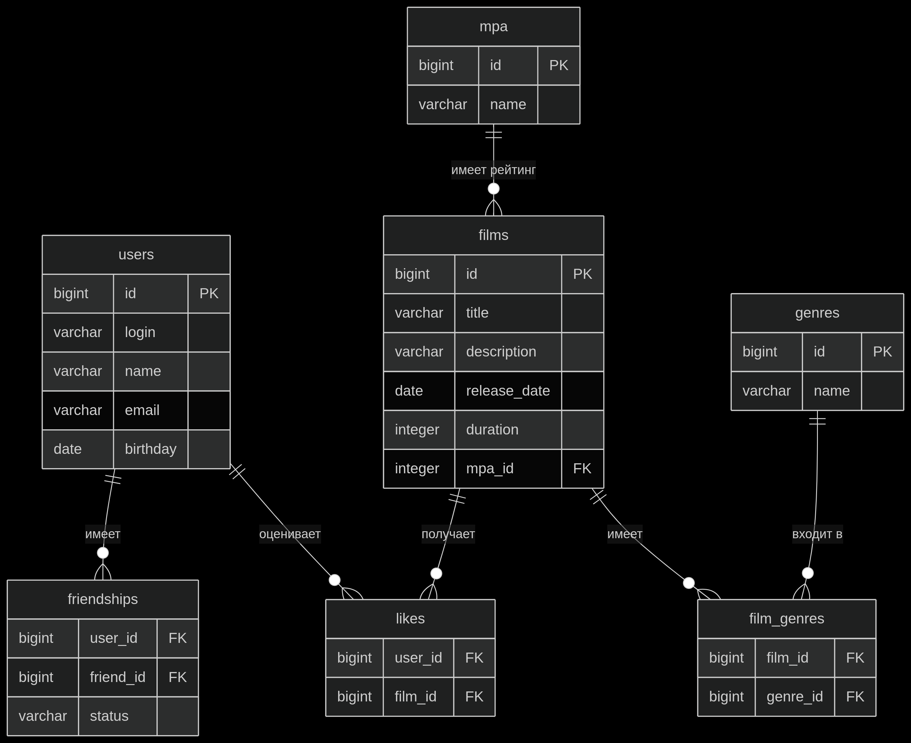

# 🎬 Filmorate

## 📖 О проекте

Filmorate — это социальная сеть для оценки и рекомендаций фильмов. Пользователи могут делиться впечатлениями о фильмах, ставить оценки, находить друзей с похожими вкусами и открывать для себя новые кинокартины.

## 🏗 Архитектура

### Стек технологий

| Слой | Технологии |
|------|------------|
| **📊 База данных** | PostgreSQL 15, Spring JDBC, JDBC Template |
| **🔧 Backend** | Java 17, Spring Boot 3, Spring Web, Spring Validation |
| **🛠 Инструменты** | Lombok, Maven, SLF4J + Logback |
| **✅ Валидация** | Jakarta Validation, Custom Validators |
| **🏗 Архитектура**  | REST API, Layered Architecture, DAO |

### 🚀 API Endpoints

#### Фильмы

GET /films - получить все фильмы

GET /films/{id} - получить фильм по ID

GET /films/popular?count={n} - получить топ-N популярных фильмов

POST /films - создать новый фильм

PUT /films/{id} - обновить фильм

PUT /films/{id}/like/{userId} - поставить лайк

DELETE /films/{id}/like/{userId} - удалить лайк

#### Пользователи

GET /users - получить всех пользователей

GET /users/{id} - получить пользователя по ID

GET /users/{id}/friends - получить друзей пользователя

GET /users/{id}/friends/common/{otherId} - получить общих друзей

POST /users - создать нового пользователя

PUT /users/{id} - обновить пользователя

PUT /users/{id}/friends/{friendId} - отправить запрос в друзья

PUT /users/{id}/friends/{friendId}/confirm - подтвердить дружбу

DELETE /users/{id}/friends/{friendId} - удалить из друзей

